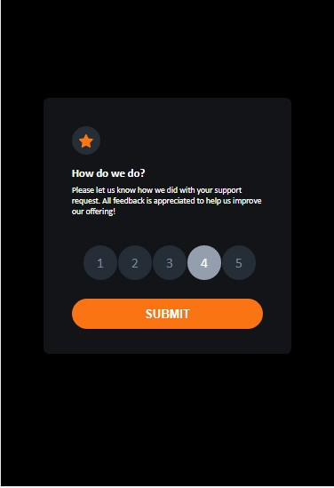
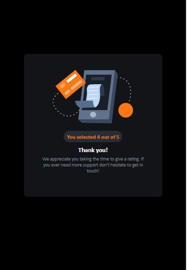
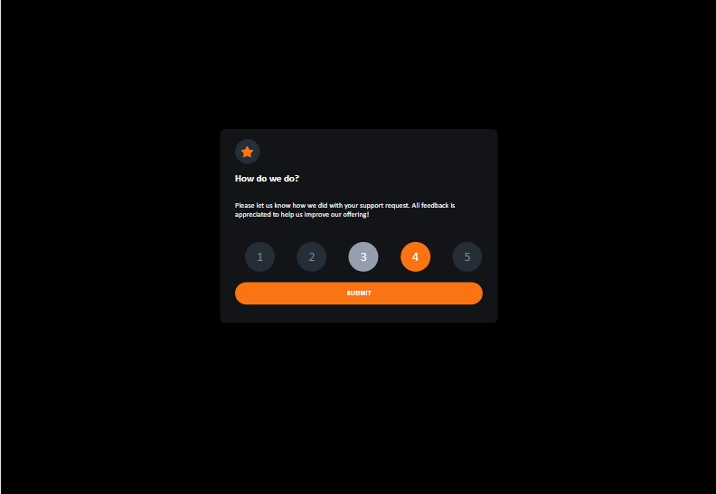
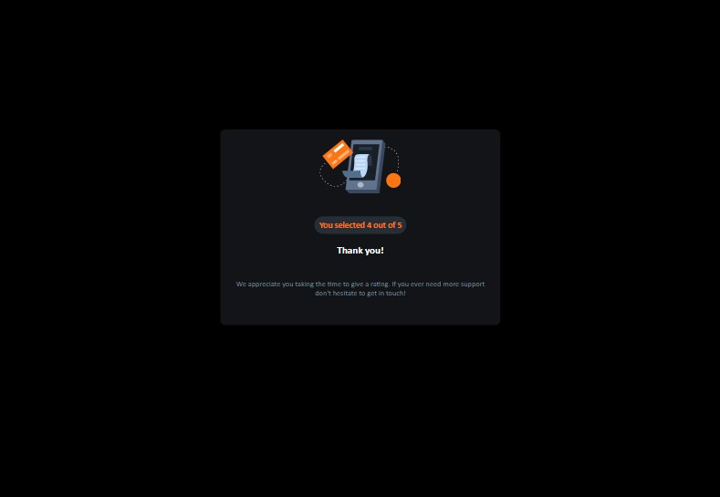

This is a solution to the [Interactive rating component challenge on Frontend Mentor](https://www.frontendmentor.io/challenges/interactive-rating-component-koxpeBUmI). Frontend Mentor challenges help you improve your coding skills by building realistic projects. 

## Table of contents

- [Overview](#overview)
  - [The challenge](#the-challenge)
  - [Screenshot](#screenshot)
  - [Links](#links)
- [My process](#my-process)
  - [Built with](#built-with)
  - [What I learned](#what-i-learned)
  - [Continued development](#continued-development)
  - [Useful resources](#useful-resources)
- [Author](#author)


## Overview

### The challenge

Users should be able to:

- View the optimal layout for the app depending on their device's screen size
- See hover states for all interactive elements on the page
- Select and submit a number rating
- See the "Thank you" card state after submitting a rating

### Screenshot







### Links

Solution URL: [My Github page](https://github.com/SageKyle)
- Live Site URL: [Interactive feedback component](https://sagekyle.github.io/interactive-feedback-component/)

## My process

### Built with

- Semantic HTML5 markup
- CSS custom properties
- Flexbox
- CSS Grid
- Desktop-First workflow
- Javascript Events
- DOM
- Javascript Functions


### What I learned

Through this project, I learned how to work with the Javascript Document Object Model (DOM): 
selecting HTML elements using various DOM selectors: 

```js
document.getElementByClassName('id-main');   // for selecting elements by their IDs
document.getElementById('section-class);     // for selecting elements by their Classes 
document.querySelector('.section-class);     // for selecting the first element of a given Class 
document.querySelectorAll('.section-class);     // for selecting ALL elements with the same Class name 
```
I also learned how to add events to specific objects in the DOM and also Event Bubbling/Event Capturing

```js
numberOfStars.addEventListener('click', function (e) {
    if (e.target.className === 'rating-label') {
        e.target.previousElementSibling.checked = true;
        star.textContent = e.target.textContent;
    }
})

```

### Continued development

In CSS, I want to learn how to use the Mobile-First Design approach. Most of the websites I'm going to be working on will be Mobile-focused so I think it would make my CSS, specifically Media Queries easier and straightforward.
I also need to improve on my working knowledge of Media Queries.

In Javascript, I still have a lot to learn but I want to first master DOM manipulation and Event handling


### Useful resources

- [W3Schools](https://www.w3schools.com/jsref/dom_obj_event.asp) - This helped me for understanding Javascript Events and Event listeners.
[The Markdown Guide](https://www.markdownguide.org/) - This helped me with understanding a little about markdown.

## Author

- Website - [Paul ominyi](https://www.your-site.com)
- Frontend Mentor - [@SaGeKyle](https://www.frontendmentor.io/profile/SaGeKyle)
- Twitter - [@Ominyi_Sage](https://www.twitter.com/Ominyi_Sage)
